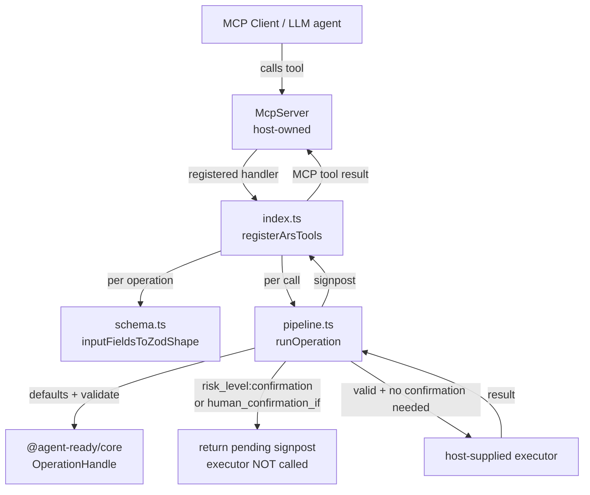

# @agent-ready/adapter-mcp Design

**Spec**: `.specs/features/adapter-mcp/spec.md`
**Status**: Draft

---

## Research Summary (Knowledge Verification Chain)

- **Step 1 (codebase)**: `packages/core/src/adapter.ts` (`AdapterResolvers`/`Adapter`/`createAdapter`), `packages/core/src/validator.ts` (`validateInput`, `applyDefaults` — confirmed `needsHumanConfirmation` fires both from `risk_level: confirmation` and from field-level `human_confirmation_if`, e.g. `financeiro.yml`'s `registrar_gasto.valor.human_confirmation_if.gt: 500` on a `risk_level: validated` op), `packages/core/src/signpost.ts` (`generateSignpost`), `packages/core/src/index.ts` (`AgentReady`, `OperationHandle`). `computed_fields` confirmed unused outside `types.ts` (grep). `state_guards` confirmed disconnected from `AdapterResolvers` (`OperationHandle.resolveGuard` takes a free-form predicate name, never invoked automatically from `operation.state_guards`).
- **Step 2 (project docs)**: `docs/implementation_plan.md` (local, gitignored) logs the SQL-vs-predicate `state_guards` question as unresolved — informed AD-003.
- **Step 3 (Context7 MCP)**: not available in this environment — skipped, went to Step 4.
- **Step 4 (web search)**: `@modelcontextprotocol/sdk` TypeScript — `McpServer` from `@modelcontextprotocol/sdk/server/mcp.js`, `server.registerTool(name, { title, description, inputSchema }, handler)`, Zod schemas auto-converted to JSON Schema, handler returns `{ content: [{type:'text', text}], structuredContent?, isError? }`. Source: official `anthropics/skills` MCP builder reference + npm/GitHub SDK docs (see chat for URLs).
- **Uncertainty resolved in T1**: installed `@modelcontextprotocol/sdk@1.29.0`'s `dist/esm/server/mcp.d.ts` confirms `registerTool<...>(name, config: { inputSchema?: InputArgs, ... }, cb)` where `InputArgs extends undefined | ZodRawShapeCompat | AnySchema`, and `ZodRawShapeCompat = Record<string, AnySchema>` (`zod-compat.d.ts`) — a **raw shape object**, not a wrapped `z.object(...)`/`ZodObject`. `schema.ts` therefore returns `Record<string, z.ZodTypeAny>` directly; no wrapping step.

---

## Architecture Overview

Three-module split, mirroring the "extract handler for testability" pattern from the official MCP testing guide, and matching this repo's existing adapter convention (pure logic separate from SDK glue):



- `schema.ts` has zero dependency on the MCP SDK's runtime beyond the `zod` package — pure function, unit-testable in isolation.
- `pipeline.ts` has zero dependency on `McpServer` — takes an `OperationHandle` (already resolved by name), an optional executor, and raw input; returns a plain MCP-tool-result-shaped object. Directly testable without any transport, matching the researched testing pattern.
- `index.ts` is the only file that imports `McpServer`/`registerTool` — thin glue, loops over `agent.allOperations`, wires `schema.ts` + `pipeline.ts` together.

---

## Code Reuse Analysis

### Existing Components to Leverage

| Component | Location | How to Use |
| --- | --- | --- |
| `AgentReady` / `OperationHandle` | `packages/core/src/index.ts` | `registerArsTools` takes an already-loaded `AgentReady` instance; `pipeline.ts` calls `.applyDefaults()`, `.validate()`, `.signpost()` on the `OperationHandle` per operation |
| `validateInput` / `applyDefaults` semantics | `packages/core/src/validator.ts` | Consumed indirectly via `OperationHandle` — not reimplemented |
| `SignpostResult` shape | `packages/core/src/types.ts` | `pipeline.ts` maps `SignpostResult` → MCP tool result (`content`/`structuredContent`/`isError`) |
| `getInputFields` (via `OperationHandle.fields`) | `packages/core/src/loader.ts` | `schema.ts` reads `.fields` to build the Zod shape — reuses the already-normalized `InputField[]`, never re-parses raw YAML |
| Package layout convention (`package.json`, `tsconfig.json`, peer dep on `@agent-ready/core`) | `packages/adapter-rest/`, `packages/adapter-sqlite/` | Copy shape: `type: module`, `tsc` build, `@agent-ready/core` as `peerDependencies` + `devDependencies` |
| `AdapterError` isolation pattern | `packages/core/src/adapter.ts` | Same "errors from one resolver/executor don't crash the whole thing" principle applied to executor calls in `pipeline.ts` |

### Integration Points

| System | Integration Method |
| --- | --- |
| `@modelcontextprotocol/sdk` | `peerDependencies` (host provides the `McpServer` instance and owns the transport/connection) + `devDependencies` for build-time types |
| `zod` | Real `dependencies` entry — `schema.ts` actively constructs Zod objects at runtime, unlike the type-only `better-sqlite3` usage in `adapter-sqlite` |

---

## Components

### `schema.ts`

- **Purpose**: Convert an ARS `InputField[]` into a Zod object usable as an MCP tool's `inputSchema`.
- **Location**: `packages/adapter-mcp/src/schema.ts`
- **Interfaces**:
  - `inputFieldsToZodShape(fields: InputField[]): Record<string, z.ZodTypeAny>` — one Zod type per field.
  - `operationInputSchema(operation: Operation): Record<string, z.ZodTypeAny>` — calls `getInputFields(operation)` then `inputFieldsToZodShape`; returns the raw shape directly (matches SDK's `ZodRawShapeCompat`, confirmed in T1 — no `z.object()` wrapping).
- **Dependencies**: `zod`, `@agent-ready/core` types (`InputField`, `Operation`).
- **Reuses**: `getInputFields`/`OperationHandle.fields` normalization (no re-parsing of raw map-vs-array `input_schema`).
- **Mapping table** (Tech Decision — see below for why constraints are excluded):

  | ARS `type` | Zod | Notes |
  | --- | --- | --- |
  | `string` | `z.string()` | |
  | `int` | `z.number().int()` | |
  | `decimal` | `z.number()` | |
  | `bool` | `z.boolean()` | |
  | `date` | `z.string()` | `.describe()` notes expected format (e.g. `YYYY-MM-DD`) |
  | `datetime` | `z.string()` | |
  | `enum` | `z.enum(values as [string, ...string[]])` | falls back to `z.string()` if `values` is empty/undefined |
  | `base64` | `z.string()` | documented approximation (MCP-08) |
  | `any` | `z.any()` | documented approximation (MCP-08) |
  | (all) `required: false` or absent | wrapped in `.optional()` | |
  | (all) `description` present | `.describe(field.description)` | |

### `pipeline.ts`

- **Purpose**: Pure orchestration — run the full governance pipeline for one tool call and return an MCP-shaped result. No SDK/transport dependency.
- **Location**: `packages/adapter-mcp/src/pipeline.ts`
- **Interfaces**:
  - `type ExecutorFn = (input: Record<string, unknown>) => Promise<Record<string, unknown>> | Record<string, unknown>`
  - `type ExecutorMap = Record<string, ExecutorFn>`
  - `runOperation(op: OperationHandle, executor: ExecutorFn | undefined, rawInput: Record<string, unknown>, context?: Record<string, unknown>): Promise<McpToolResult>`
  - `type McpToolResult = { content: [{ type: 'text'; text: string }]; structuredContent?: Record<string, unknown>; isError?: boolean }`
- **Dependencies**: `OperationHandle` (from `@agent-ready/core`).
- **Reuses**: `op.applyDefaults()`, `op.validate()`, `op.signpost()`.
- **Logic** (implements MCP-03 through MCP-06):

  ```
  1. input = op.applyDefaults(rawInput, context ?? {})
  2. result = op.validate(input, context ?? {})
  3. if (!result.valid) → return toMcpResult(op.signpost('validation_error', { errors: result.errors }), isError: true)
  4. if (result.needsHumanConfirmation) → return toMcpResult(op.signpost('pending', input), isError: false)   // executor NOT called — AD-002
  5. if (!executor) → return { content: [...'no executor configured for "<name>"...'], isError: true }
  6. try { execResult = await executor(input) }
     catch (err) → return { content: [...'executor failed: ' + err.message...], isError: true }   // message only, no stack — MCP-07
  7. return toMcpResult(op.signpost('success', execResult), isError: false)
  ```

  `toMcpResult(signpost)`: `content[0].text = signpost.guidance`; `structuredContent = signpost` (the whole object — `data`, `alerts`, `next`, `reason`, `what_to_do`, `errors`, `suggestions` all ride along for MCP clients that read `structuredContent`).

### `index.ts`

- **Purpose**: Public entry point — thin glue between `AgentReady`, `schema.ts`, `pipeline.ts`, and the MCP SDK.
- **Location**: `packages/adapter-mcp/src/index.ts`
- **Interfaces**:
  - `registerArsTools(server: McpServer, agent: AgentReady, executors: ExecutorMap, options?: { context?: Record<string, unknown> }): void`
- **Dependencies**: `@modelcontextprotocol/sdk` (type + `registerTool` call only), `schema.ts`, `pipeline.ts`, `@agent-ready/core`.
- **Reuses**: `agent.allOperations`, `agent.operation(name)`.
- **Logic**: `for (const opDef of agent.allOperations) { const shape = operationInputSchema(opDef); server.registerTool(opDef.name, { description: opDef.description, inputSchema: shape }, (input) => runOperation(agent.operation(opDef.name), executors[opDef.name], input, options?.context)); }`

### `types.ts`

- **Purpose**: Shared local types (`ExecutorFn`, `ExecutorMap`, `McpToolResult`) so `pipeline.ts` and `index.ts` don't duplicate them.
- **Location**: `packages/adapter-mcp/src/types.ts`

---

## Data Models

No new persisted data models — this package is stateless glue. The only "model" is the `McpToolResult` shape defined above, which mirrors the MCP SDK's own tool-result contract.

---

## Error Handling Strategy

| Error Scenario | Handling | Caller-visible Impact |
| --- | --- | --- |
| Input fails ARS `validateInput()` | `pipeline.ts` step 3 | `isError: true`, `structuredContent` carries `errors[]` + `reason` + `what_to_do` (Rule 1: errors teach) |
| `needsHumanConfirmation: true` (either trigger) | `pipeline.ts` step 4 — executor never called | `isError: false`, `pending` signpost explains why nothing executed |
| No executor registered for a valid call | `pipeline.ts` step 5 | `isError: true`, explicit "no executor configured for operation X" — developer-facing, not silent |
| Executor throws/rejects | `pipeline.ts` step 6, caught | `isError: true`, `err.message` only (no stack trace leaked); MCP server process keeps running |
| MCP SDK rejects input before handler runs (loose Zod shape still mismatched, e.g. wrong JSON type) | Outside bridge's control — SDK/protocol-level error | Documented limitation (spec Edge Cases) — not a defect of this package |
| Field-level `required_if` not enforceable in static Zod shape | Field stays `.optional()` at the Zod/MCP layer | Enforced anyway at runtime by `validateInput()` inside the handler — correctness preserved, only the MCP client's static hint is looser |

---

## Risks & Concerns

| Concern | Location | Impact | Mitigation |
| --- | --- | --- | --- |
| `infer_from_context` fields (e.g. `membro_id`) have no natural source of "context" over MCP | `packages/core/src/validator.ts:84` (`applyDefaults` context param) | Fields relying on inferred context will surface a `CONTEXT_MISS` warning unless the host wires one | `registerArsTools` accepts an optional `context` object (static, host-supplied at registration time); documented as a known V1 limitation — dynamic per-call context is out of scope |
| Zod vs `McpServer.registerTool` exact type signature (`ZodRawShape` vs `ZodObject`) not verified against the actually-installed SDK version | N/A (pre-install) | Could require a small signature adjustment in `index.ts` | First Task installs the real dependency and inspects its `.d.ts` before `schema.ts`/`index.ts` are finalized — flagged, not guessed (Knowledge Verification Chain Step 5 discipline) |
| `console.log` anywhere in this package would corrupt MCP stdio JSON-RPC framing (stdout is reserved for protocol messages) | New code, all files | A single accidental `console.log` breaks every tool call for any consumer using stdio transport | Task-level rule: this package never calls `console.log`; the only permitted stdout writer is the MCP SDK itself. Verified in code review / grep during Execute gate. |
| Confirmation-risk operations become unreachable via this bridge (AD-002) | Design-level, not a code location | A company's `deletar_gasto`-style operations can't be driven end-to-end through MCP alone in V1 | Documented explicitly in spec Success Criteria and README (once written) — this is a stated V1 boundary, not a silent gap |

> No test-coverage or security-specific concerns beyond the above were found — `pipeline.ts`'s isolation from the transport layer keeps the blast radius of a bug contained to a single tool call, consistent with `AdapterError`'s existing isolation principle in `core`.

---

## Tech Decisions

| Decision | Choice | Rationale |
| --- | --- | --- |
| Zod schema excludes numeric/length constraints (`gt`, `gte`, `min`, `max`, `min_length`, `max_length`) | Only `type`, `required`, `enum` values, and `description` are encoded in Zod | The MCP SDK validates `inputSchema` **before** invoking the registered handler — a Zod-level rejection becomes a protocol-level error the bridge cannot intercept or reshape into ARS's `validation_error` signpost. Keeping Zod loose ensures every real constraint check happens inside `pipeline.ts` via `validateInput()`, which the bridge fully controls, giving one consistent source of truth for validation errors instead of two disagreeing validators. |
| `structuredContent` carries the full `SignpostResult` object, not just `data` | Whole signpost (`guidance`, `data`, `alerts`, `next`, `reason`, `what_to_do`, `errors`, `suggestions`) passed through | MCP clients that read `structuredContent` get the full governance context (Felipe Amorim's rules 1+3: errors teach, every response is a signpost) instead of a stripped-down success payload — this is the entire value proposition of the bridge, not an add-on |
| `context` is a static, registration-time object, not a per-call parameter | `registerArsTools(server, agent, executors, { context })` | MCP tool calls don't have an obvious per-call channel for agent/session context distinct from the tool's own arguments; a static context (e.g. a fixed `membro_id` for a single-tenant bridge instance) covers the common case without inventing a new protocol extension. Multi-tenant/per-call context is a documented future extension, not solved here. |

> These decisions are feature-local (they don't constrain future features the way AD-001/002/003 do), so they stay in this table rather than `.specs/STATE.md`.
